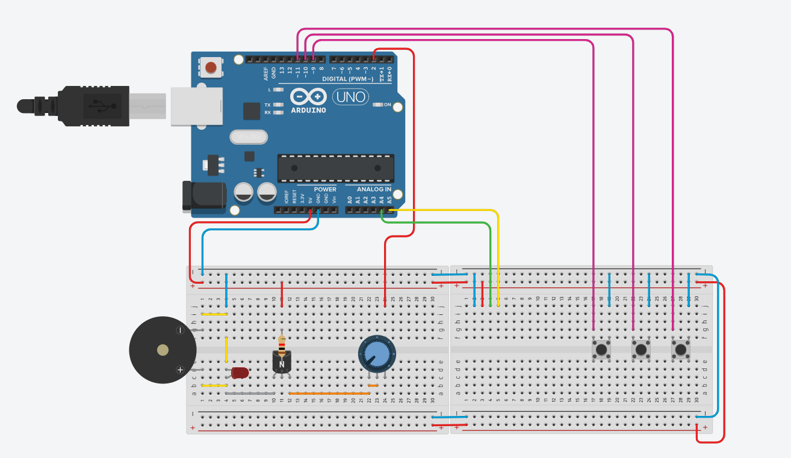
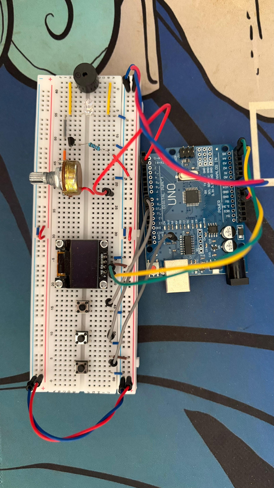

# Music Player v1.0

A music player project using an Arduino, an OLED display, and a buzzer to play melodies with a visual interface.

## 📋 Description

This project creates a functional Jukebox that allows users to browse and play songs using a menu system displayed on an OLED screen. It features non-blocking audio playback, allowing for real-time visual animations while the music plays.

## ⚙️ Components Used

- 1x Arduino Uno (or compatible)
- 1x OLED Display SSD1306 (128x64 I2C)
- 1x Passive Buzzer
- 3x Pushbuttons (Play, Next, Previous)
- 1x Transistor NPN
- 1x Resistor (10K Ω)
- 1x White Led
- 1x Potenciometer
- Jumper wires and a breadboard

## 🔌 Schematic

- **Buzzer:** Connected to digital pin 2.
- **Buttons:**
    - Play: Pin 9.
    - Previous: Pin 11.
    - Next: Pin 13.
    - *Note: Buttons utilize the internal pull-up resistors (INPUT_PULLUP).*
- **Display:** Connected via I2C pins (SDA/SCL) to the Arduino.

  

## 💻 How It Works

- The Arduino manages a menu interface on the OLED display, allowing navigation between tracks.
- It includes a predefined library of songs: "Take on Me", "Fur Elise", and "Despacito".
- The playback engine is non-blocking, meaning the code continuously updates the display with a scrolling title and a visualizer bar without interrupting the melody.
- The "Play" button toggles between playing and stopping the current track.

## 🚀 How to Use

1. Assemble the circuit according to the schematic.
2. Open the file `sketch_player_music/sketch_player_music.ino` in the Arduino IDE.
3. Ensure the `func_musica.cpp` and `func_musica.h` files are in the same folder.
4. Select the correct board and port.
5. Upload the code to the Arduino.
6. Use the Next/Previous buttons to select a song and the Play button to start listening.

## 📝 Code

The code is available in the [`sketch_player_music`](./sketch_playermusic/sketch_player_music.ino) folder.

## 📄 License

This project is licensed under the MIT License.

---

*Developed by Felipe Grolla*