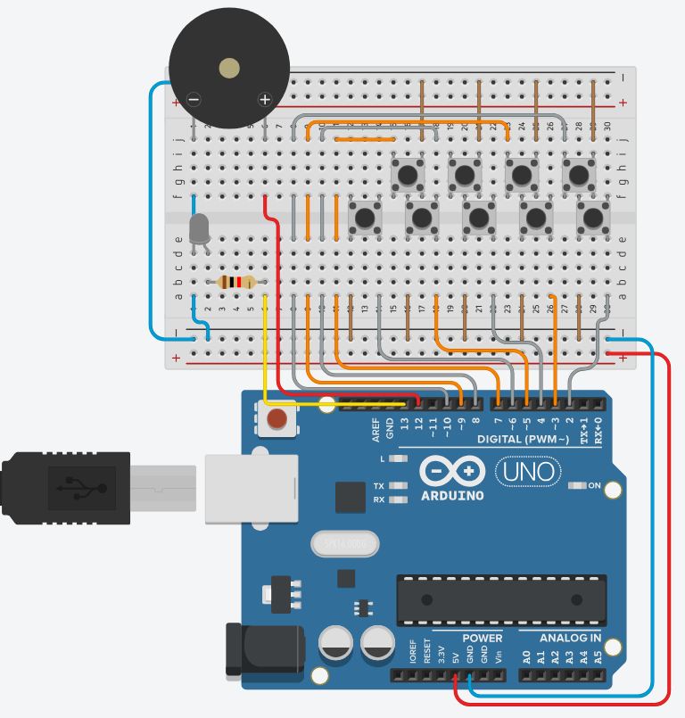

# Jukebox Project

An Arduino jukebox project where 9 physical buttons let you select and play different classic songs using a piezo buzzer.

## 📋 Description

The Jukebox project uses an Arduino, a piezo buzzer, and 9 physical push buttons. Each button, when pressed, plays a different classic song. The songs are stored as arrays of notes and durations, and selection is handled via hardware, making the experience interactive and fun.

## ⚙️ Components Used

- 1x Arduino Uno (or compatible)
- 1x Piezo buzzer
- 9x Push buttons
- 1x 1kΩ resistors
- Jumper wires and breadboard

## 🔌 Schematic

- Each button is connected to a digital pin on the Arduino with a pull-down resistor.
- The buzzer is connected to a digital pin (e.g., D12).
- Optional: LED to indicate when a song is playing.

  

## 💻 How It Works

- The Arduino monitors all 9 buttons.
- When a button is pressed, the corresponding song is played on the buzzer.
- Each song is defined as arrays of notes and durations.
- The system can be easily expanded to include more songs.

## 🚀 How to Use

1. Assemble the circuit as shown in the schematic.
2. Open the file `sketch_jukebox/sketch_jukebox.ino` in the Arduino IDE.
3. Select the correct board and port.
4. Upload the code to the Arduino.
5. Press any of the 9 buttons to play the corresponding song.

## 📝 Code

- Main code: [`sketch_jukebox/sketch_jukebox.ino`](./sketch_jukebox/sketch_jukebox.ino)
- Note definitions: [`sketch_jukebox/notas.h`](./sketch_jukebox/notas.h)

## 📄 License

This project is licensed under the MIT License.

---

*Developed by