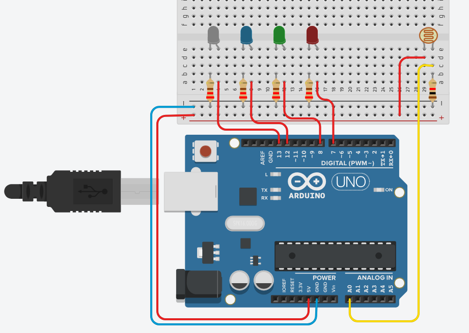
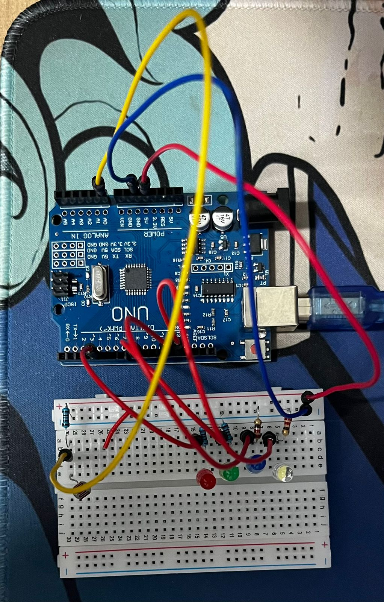

# Light Meter

Um projeto de medidor de luminosidade utilizando Arduino, sensor LDR e LEDs para indicar o nível de luz ambiente.

## 📋 Descrição

Este projeto utiliza um sensor LDR (Light Dependent Resistor) para medir a intensidade da luz no ambiente. Conforme o valor lido pelo sensor, diferentes LEDs são acionados para indicar o nível de luminosidade detectado.

## ⚙️ Componentes Utilizados

- 1x Arduino Uno (ou compatível)
- 1x Sensor LDR
- 4x LEDs (cores variadas)
- 4x Resistores para LEDs (220Ω ou 330Ω)
- 1x Resistor para LDR (10kΩ recomendado)
- Jumpers e protoboard

## 🔌 Esquemático

- O LDR é conectado em um divisor de tensão com o resistor de 10kΩ, ligado a uma entrada analógica do Arduino.
- Cada LED é conectado a uma porta digital do Arduino, com resistor limitador.

## 💻 Funcionamento

- O Arduino lê o valor analógico do LDR.
- Dependendo do valor lido, acende uma quantidade diferente de LEDs para indicar se o ambiente está claro, médio, escuro ou muito escuro.
- Os valores de referência podem ser ajustados no código conforme a necessidade.

## 🚀 Como Usar

1. Monte o circuito conforme o esquemático.
2. Abra o arquivo `sketch_light_meter/sketch_light_meter.ino` na IDE do Arduino.
3. Selecione a placa e porta corretas.
4. Faça o upload do código para o Arduino.
5. Observe os LEDs indicando o nível de luminosidade.

## 📝 Código

O código está disponível na pasta [`sketch_light_meter`](./sketch_light_meter/sketch_light_meter.ino).

## 📄 Licença

Este projeto está licenciado sob a licença MIT.

---

*Desenvolvido por Felipe Grolla